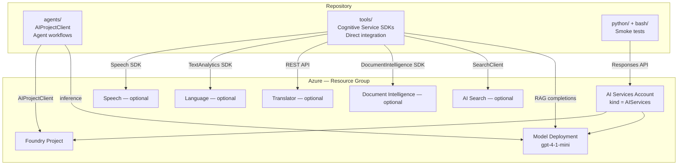

# Azure AI Foundry Lab

This repository contains a small Terraform-based Azure AI Foundry lab plus simple Python and Bash smoke tests and local tool examples.

## Purpose

The goal is to provision a minimal Foundry environment that is easy to understand and easy to validate:

- Resource group
- Azure AI Services account with Foundry project management enabled
- Foundry project resource
- Azure OpenAI model deployment
- Optional Azure AI Speech resource for tool scenarios
- Optional Azure AI Language resource for text analytics tool scenarios
- Optional Azure AI Translator resource for translation tool scenarios
- Optional Azure AI Document Intelligence resource for document extraction tool scenarios
- Optional Azure AI Search resource for search and RAG tool scenarios
- Optional RBAC assignment for the current authenticated principal

The repository is designed for learning and controlled experimentation. It is not a production baseline.

## Main Components

### Azure AI Foundry

Azure AI Foundry is the workspace layer for building AI applications. In this repo, Terraform provisions the Azure AI Services account and Foundry project resources that back that experience.

### Foundry Models

The Terraform deployment creates a model deployment so the environment is usable immediately after apply, assuming the selected model is available in the target region.

### Foundry Agent Service

Agent workflows are not provisioned directly here. The repo prepares the core platform resources you would use before adding agents in the Foundry experience.

### Tools / Integrations

The repository has three code areas with different purposes:

- **`agents/`** uses the `azure-ai-projects` SDK and `AIProjectClient` to define, version, and run agents orchestrated by the Foundry project. This is the place for agent workflows, tool attachments (web search, code interpreter, OpenAPI), and agent lifecycle patterns.
- **`tools/`** uses service-specific Azure SDK clients — `TextAnalyticsClient`, `DocumentIntelligenceClient`, `SearchClient`, and the Speech SDK — to call each cognitive service directly, without an agent layer. Each script is a focused end-to-end example for one service.
- **`python/`** and **`bash/`** are minimal smoke tests that validate the base Foundry deployment (model response through the Responses API and endpoint reachability).

## Architecture



## Repository Structure

```text
.
├── README.md
├── agents/
│   ├── README.md
│   ├── 01_infra_triage.py
│   ├── 02_websearch_agent.py
│   ├── 03_code_interpreter_agent.py
│   ├── 04_openapi_agent.py
│   ├── activities_openapi.json
│   ├── bookstore_sales.csv
│   └── pyproject.toml
├── bash/
│   └── test.sh
├── infra/
│   └── terraform/
│       ├── backend.hcl.example
│       ├── data.tf
│       ├── main.tf
│       ├── outputs.tf
│       ├── providers.tf
│       ├── rbac.tf
│       ├── language.tf
│       ├── speech.tf
│       ├── translator.tf
│       ├── document_intelligence.tf
│       ├── search.tf
│       ├── terraform.tfvars.example
│       ├── variables.tf
│       └── README.md
├── tools/
│   ├── README.md
│   ├── .env.example
│   ├── 01_speech_tool.py
│   ├── 02_language_tool.py
│   ├── 03_translation_tool.py
│   ├── 04_document_intelligence.py
│   ├── 05_search_tool.py
│   └── pyproject.toml
└── python/
    ├── README.md
    ├── .env.example
    ├── chat_with_openai.py
    ├── openapi_test.py
    └── pyproject.toml
```

## Terraform Structure

- `providers.tf`: Terraform and provider versions. Authentication is intentionally left to standard Azure mechanisms such as Azure CLI login or environment variables.
- `variables.tf`: Input variables for naming, model settings, tags, RBAC, and network access.
- `data.tf`: Reads the current authenticated Azure principal.
- `main.tf`: Creates the resource group, Azure AI Services account, Foundry project, and model deployment.
- `language.tf`: Optionally creates a dedicated Azure AI Language resource with a custom subdomain for text analytics scenarios.
- `speech.tf`: Optionally creates a dedicated Azure AI Speech resource with a custom subdomain for Speech SDK scenarios.
- `translator.tf`: Optionally creates a dedicated Azure AI Translator resource with a custom subdomain for translation scenarios.
- `document_intelligence.tf`: Optionally creates a dedicated Azure AI Document Intelligence resource with a custom subdomain for document extraction scenarios.
- `search.tf`: Optionally creates a dedicated Azure AI Search service with semantic search enabled for search and RAG scenarios.
- `rbac.tf`: Optionally grants the current principal the `Cognitive Services OpenAI User` role on the account.
- `outputs.tf`: Returns the names and endpoints needed after deployment, including optional Speech outputs.
- `backend.hcl.example`: Example values for moving Terraform state to Azure Storage.
- `README.md`: Terraform-specific usage notes, including the optional Speech deployment.

## Prerequisites

- Azure subscription with permission to create AI resources
- Terraform `>= 1.5`
- Azure CLI
- Python 3.12+ and `uv` if you want to run the Python smoke tests
- `jq` if you want to run the Bash smoke test

## Authentication

The recommended local path is Azure CLI authentication:

```bash
az login
az account set --subscription "<your-subscription-id-or-name>"
```

If you prefer service principal authentication, use the standard AzureRM environment variables rather than storing credentials in Terraform files.

## Deploy

1. Move to the Terraform folder:

```bash
cd infra/terraform
```

2. Create a local variable file:

```bash
cp terraform.tfvars.example terraform.tfvars
```

3. Adjust location, naming, and model settings as needed.

4. Initialize and review the plan:

```bash
terraform init
terraform plan
```

If you want to use an Azure Storage backend later, copy `backend.hcl.example` to `backend.hcl` and initialize with backend config after you create the storage resources:

```bash
cp backend.hcl.example backend.hcl
terraform init -backend-config=backend.hcl
```

5. Deploy:

```bash
terraform apply
```

6. Destroy when finished:

```bash
terraform destroy
```

## Run the Smoke Tests

### Python

See [python/README.md](python/README.md) for the local setup. These scripts are for manual validation, not automated production operations.

### Tools

See [tools/README.md](tools/README.md) for the local tool examples. If you enable the optional Speech, Language, Translator, Document Intelligence, or Search deployment in Terraform, use the corresponding outputs for the local scripts.

### Bash

Set the required environment variables and run:

```bash
export AZURE_ENDPOINT="https://<your-foundry-account>.cognitiveservices.azure.com/"
export AZURE_API_KEY="<api-key>"
export MODEL_DEPLOYMENT_NAME="gpt-4-1-mini"

bash/test.sh
```

## Security and Readiness Notes

- Local secret values have been removed from the checked-in examples.
- Terraform no longer requires client secrets in `terraform.tfvars`.
- API keys are not exposed as Terraform outputs.
- Public network access is still enabled by default for lab simplicity.
- Remote backend scaffolding is documented, but the storage resources and state migration are still a manual step.

## Practical Next Improvements

1. Add an Azure Storage remote backend for Terraform state.
2. Add a private networking option for the AI Services account.
3. Add CI checks for `terraform fmt`, `terraform validate`, and basic script linting.
4. Replace ad hoc smoke tests with repeatable integration tests.
